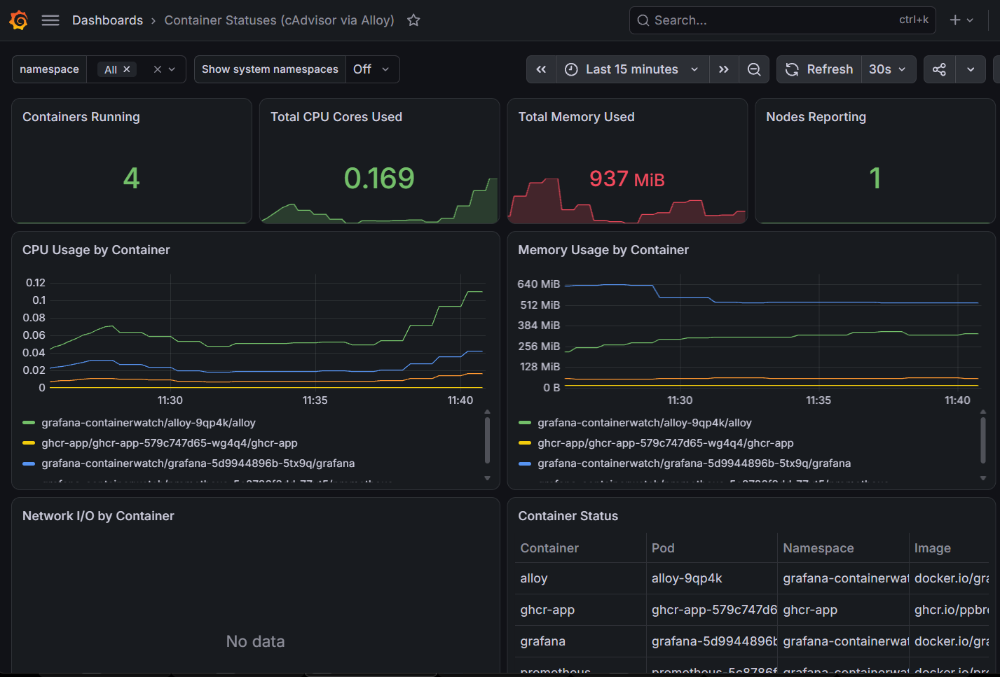

# helm-grafana-containerwatch

Pre-configured **SIMPLE** cluster-wide container monitoring dashboard.

Yes, [kube-prometheus-stack](https://artifacthub.io/packages/helm/prometheus-community/kube-prometheus-stack) 
exists. however, it is ludicrously over-complicated for what I want to see:
Basic usage stats, sorted by either Container, Pod, or Namespace

Deploys Alloy (via DaemonSet) + Prometheus + Grafana, packaged
as a Helm chart. Alloy is deployed to every node, so it can then collect
per-container metrics on every node. It pushes them to Prometheus via
`remote_write`.

Grafana is deployed with a Prometheus datasource and a
["Container Statuses" dashboard](templates/grafana-dashboards-configmap.yaml).

## Values

| Key | Default | Notes |
|---|---|---|
| `prometheus.image.tag` | `v3.14.0` | |
| `prometheus.service.type` | `ClusterIP` | `ClusterIP` / `NodePort` / `LoadBalancer` |
| `alloy.image.tag` | `v1.19.2` | |
| `alloy.containerdHostDir` / `alloy.containerdSocketPath` | `/run/containerd`, `/run/containerd/containerd.sock` | Set to k3s's paths (`/run/k3s/containerd/...`) on k3s clusters |
| `alloy.dockerSocketPath` | `/var/run/docker.sock` | |
| `grafana.image.tag` | `13.2.1` | |
| `grafana.adminUser` / `grafana.adminPassword` | `admin` / `admin` | Set via env vars, no forced first-login change |
| `grafana.service.type` | `ClusterIP` | `ClusterIP` / `NodePort` / `LoadBalancer` |
| `grafana.ingress.enabled` / `.className` / `.host` / `.annotations` / `.tls` | `false` / `""` / `""` / `{}` / `[]` | Used if you set this up in "The Cloud" |
| `grafana.dashboards.enabled` | `true` | Provisions the "Container Statuses" dashboard |
| `grafana.persistence.enabled` | `false` | Use a PVC for `/var/lib/grafana` instead of `emptyDir` |
| `grafana.persistence.size` | `1Gi` | |
| `grafana.persistence.storageClassName` | `""` | Cluster default if unset |
| `grafana.persistence.existingClaim` | `""` | Reuse an existing PVC instead of creating one |

By default, Prometheus and Grafana use `emptyDir` storage - data is lost on pod
restart/reschedule. For many people this is fine. However, to change to a
persistent storage method, 
set `grafana.persistence.enabled: true` to get a PVC (size/storageClassName
configurable), or set `existingClaim` to reuse one. 

## Access

Choose one of three ways to access the Grafana service
(Using the values for `grafana.adminUser`/`grafana.adminPassword`)

**Port-forward** (default, no config needed):
Set up a *temporary* port forwarder via CLI:
    kubectl port-forward -n <namespace> svc/grafana 3000:3000

**LoadBalancer** - set `grafana.service.type=LoadBalancer`, then access through
 the 'EXTERNAL-IP' and port listed by the command below:

    kubectl get svc -n <namespace> grafana

**Ingress** - set `grafana.ingress.enabled=true` plus `.className`/`.host`/`.tls` as needed.

